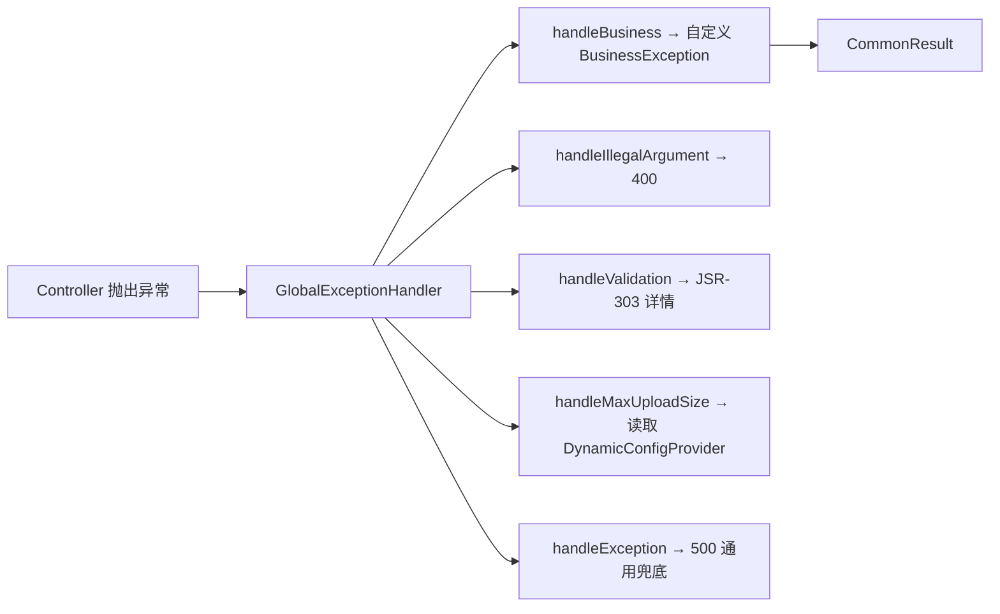

# GlobalExceptionHandler 代码质量分析

分析范围：[GlobalExceptionHandlerTest.java](backend/src/test/java/cn/rbac/server/framework/web/core/GlobalExceptionHandlerTest.java) 及其被测实现 [GlobalExceptionHandler.java](backend/src/main/java/cn/rbac/server/framework/web/core/GlobalExceptionHandler.java)

---

## 1. 测试覆盖度分析

### 1.1 覆盖缺口

被测 `GlobalExceptionHandler` 共注册了 **12** 个 `@ExceptionHandler` 方法，测试目前覆盖了 **4** 个：

| 异常类型 | 是否测试 | 风险 |
|---|---|---|
| `IllegalStateException` | ✅ | — |
| `IllegalArgumentException` | ✅ | — |
| `BusinessException` | ✅ | — |
| `AccessDeniedException` | ✅ | — |
| `MaxUploadSizeExceededException` | ❌ | **中**：依赖 `DynamicConfigProvider`，逻辑分支未被验证 |
| `SecurityException` | ❌ | **低**：简单逻辑，风险低 |
| `MethodArgumentNotValidException` | ❌ | **中**：含流式拼接逻辑（`stream().map().collect(Collectors.joining("; "))`），有分支：fieldErrors 为空时的回退消息 |
| `HttpMessageNotReadableException` | ❌ | **低**：简单消息返回，但含 `log.warn` 日志调用 |
| `MissingServletRequestParameterException` | ❌ | **中**：含字符串拼接 `"缺少必要参数: " + e.getParameterName()` |
| `MethodArgumentTypeMismatchException` | ❌ | **中**：含字符串拼接 `"参数类型错误: " + e.getName()` |
| `NoHandlerFoundException` | ❌ | **中**：返回 404 HTTP 状态码，`@ResponseStatus` 行为未验证 |
| `Exception`（通用兜底） | ❌ | **高**：这是全局兜底 handler，若抛出 NullPointerException 等未捕获异常，行为不可见 |

**结论：测试覆盖率偏低（4/12 = 33%）。** 虽然简单 handler 逻辑风险较低，但有多个含字符串拼接、日志调用、条件分支的 handler 未覆盖。

### 1.2 测试用例质量

**优点：**
- 方法命名清晰且一致（`handleXxx_returnsExpected` 格式）
- 使用 `@DisplayName` 提供中文描述，可读性好
- 使用 `MockitoExtension` 而非 `SpringBootTest`，测试轻量高效
- 断言聚焦单一结果，职责明确

**问题：**

| 问题 | 位置 | 说明 |
|---|---|---|
| 冗余的 `Objects.requireNonNull` | `GlobalExceptionHandlerTest.java:31` | `handler` 是 `new` 出来的局部变量，不可能为 null |
| 注入的 Mock 从未使用 | `GlobalExceptionHandlerTest.java:24` | `dynamicConfigProvider` 被 `@Mock` 并注入，但没有一个测试方法用到它（对应的 `handleMaxUploadSize` 未被测试） |
| 无边界/异常场景 | 多处 | 未测试异常对象携带 null message、空字符串 message 等情况 |
| 无 HTTP 状态码验证 | 全部 | `@ResponseStatus` 的 HTTP 状态在 Spring MVC 容器外无法验证，但可以通过 `MockMvc` 集成测试覆盖 |
| 无 SpEL/JSR-303 验证 | 全部 | `MethodArgumentNotValidException` 的 binding-result 含复杂嵌套结构，值得单独测试 |

---

## 2. 生产代码质量分析

### 2.1 架构与设计



- **设计模式**：标准 `@RestControllerAdvice` 全局异常处理器模式，职责清晰。
- **依赖关系**：仅依赖 `DynamicConfigProvider` 接口（非具体实现），符合依赖倒置原则。
- **日志分级**：对 `HttpMessageNotReadableException` 使用 `warn`，对通用 `Exception` 使用 `error` + 完整堆栈，分级合理。

### 2.2 具体发现的代码问题

#### 问题 1：「兑底」疑似拼写错误

```java
/** 通用兑底异常处理 */
```

`line:105`，「兑底」应为「兜底」或「fallback」。虽然不影响运行，但反映代码审查遗漏。

#### 问题 2：`handleBusiness` 缺少 `@ResponseStatus`

`GlobalExceptionHandler.java:42-45`，与其它 handler 不同：

```java
@ExceptionHandler(BusinessException.class)
public CommonResult<Void> handleBusiness(BusinessException e) {
    return CommonResult.error(e.getCode(), e.getMessage());
}
```

**影响**：没有 `@ResponseStatus`，Spring 默认返回 **200 OK**，即 HTTP 状态码与 body 里的 `code` 字段（如 403）不一致。前端若依赖 HTTP 状态码判断错误，会误认为请求成功。

> 对比：`handleAccessDenied` 正确标注了 `@ResponseStatus(HttpStatus.FORBIDDEN)`，而同样返回 403 的 `handleBusiness` 却没有。这很可能是一个遗漏。

#### 问题 3：`CommonResult.code` 使用包装类型 `Integer`

```java
@Data
public class CommonResult<T> implements Serializable {
    private Integer code;
```

`line:8`，`Integer` 替代 `int` 增加了 NPE 风险。虽然当前静态工厂方法始终设置 `code`，但若未来新增序列化/反序列化路径（如 Jackson 反序列化时字段缺失），`code` 可为 null，可能导致上层 NPE。

建议改为 `int`（或保持在 `@Data` 生成之外做非空校验）。

#### 问题 4：`handleSecurity` 的特殊性

`GlobalExceptionHandler.java:54-58`：

```java
@ExceptionHandler(SecurityException.class)
@ResponseStatus(HttpStatus.BAD_REQUEST)
public CommonResult<Void> handleSecurity(SecurityException e) {
    return CommonResult.error(400, e.getMessage());
}
```

`SecurityException`（`java.lang.SecurityException`）通常表示 JVM 安全违规（如安全管理器拒绝），很少在业务代码中显式抛出。与 `AccessDeniedException`（Spring Security 的权限异常）语义相近但 HTTP 状态不同（400 vs 403），长期可能导致维护混淆。

建议考虑合并或明确注释两者语义区别。

#### 问题 5：`handleIllegalState` 映射为 400

`GlobalExceptionHandler.java:29-33`：

```java
@ExceptionHandler(IllegalStateException.class)
@ResponseStatus(HttpStatus.BAD_REQUEST)
```

`IllegalStateException` 通常表示方法在当前状态下被非法调用（如已关闭的连接再使用），语义上更像是 500 服务器错误而非 400 客户端错误。取决于调用方的使用意图，若确为业务校验，可考虑自定义异常或统一规范。

#### 问题 6：文件大小错误消息硬编码

`GlobalExceptionHandler.java:50-51`：

```java
int limit = dynamicConfigProvider.getFileMaxSizeMb();
return CommonResult.error(400, "文件过大，单文件不能超过 " + limit + "MB（可在系统配置-文件存储中调整）");
```

错误消息中提示文字硬编码在 handler 中，不利于国际化或跨模块复用。可考虑提取到配置或常量类。

#### 问题 7：`DynamicConfigProvider` 接口的职责

`DynamicConfigProvider.java` 包含了业务配置（token、并发登录、文件上传）的混合，单一接口承担了多个维度的配置查询。随着配置项增多，接口会持续膨胀，建议按领域拆分为多个细粒度接口或用 `Map<String, Object>` 通用查询。

---

## 3. 测试代码可维护性

### 3.1 圈复杂度感知

测试仅验证「无异常抛出时 handler 返回预期结果」。对于含拼接逻辑的 handler（如 `handleValidation`、`handleMissingParam`），建议增加：

```java
// 示例：测试 handleValidation 多条验证错误拼接
@Test
@DisplayName("handleValidation：多条错误用分号拼接")
void handleValidation_joinsMultipleErrors() {
    // given — 构造含多个 FieldError 的 MethodArgumentNotValidException
    // then — 断言 message 包含 "field1: 错误1; field2: 错误2"
}
```

### 3.2 Mock 引入的目的

当前 `@Mock DynamicConfigProvider` 仅用于注入，但没有任何测试调用 `handleMaxUploadSize`。要么移除该 mock 并清理 `ReflectionTestUtils.setField`，要么补上对 `handleMaxUploadSize` 的测试。

---

## 4. 改进建议汇总

| 优先级 | 分类 | 建议 |
|---|---|---|
| P0 | Bug | `handleBusiness` 补充 `@ResponseStatus`（按 `code` 字段动态设置或统一为 `HttpStatus.BAD_REQUEST`） |
| P1 | 拼写 | `line:105` "兑底" 改为 "兜底" |
| P1 | 测试覆盖 | 补全 `handleValidation`、`handleMissingParam`、`handleTypeMismatch`、`handleException` 的单元测试 |
| P1 | 测试清理 | 移除未使用的 `dynamicConfigProvider` mock，或补上 `handleMaxUploadSize` 测试 |
| P2 | 测试冗余 | 删除 `Objects.requireNonNull(handler)` |
| P2 | 测试增强 | 增加边界场景（null message、空 message） |
| P2 | 生产代码 | 将 `CommonResult.code` 从 `Integer` 改为 `int` |
| P3 | 设计 | 拆分 `DynamicConfigProvider` 接口 |
| P3 | 国际化 | 提取硬编码错误消息到常量或资源文件 |

---

## 5. 总结

整体代码风格与架构符合 Spring Boot 标准实践，`GlobalExceptionHandler` 的结构清晰，`GlobalExceptionHandlerTest` 的编写方式正确且高效（MockitoExtension + 轻量测试）。主要薄弱点在于：

1. **测试覆盖不全**（4/12 handler，33%），尤其是通用兜底 handler 和含字符串拼接逻辑的 handler 缺少验证；
2. **`handleBusiness` 缺少 `@ResponseStatus`** 是最值得修复的缺陷，可能导致前端异常判断错误；
3. 测试代码中存在冗余和未使用的 mock，影响可维护性。

建议优先修复 P0/P1 级问题（特别是 `@ResponseStatus` 遗漏），然后逐步补全测试覆盖。总体代码质量处于 **中等偏上** 水平，有改进空间但无明显架构缺陷。

---
*分析日期：2026-06-08*
